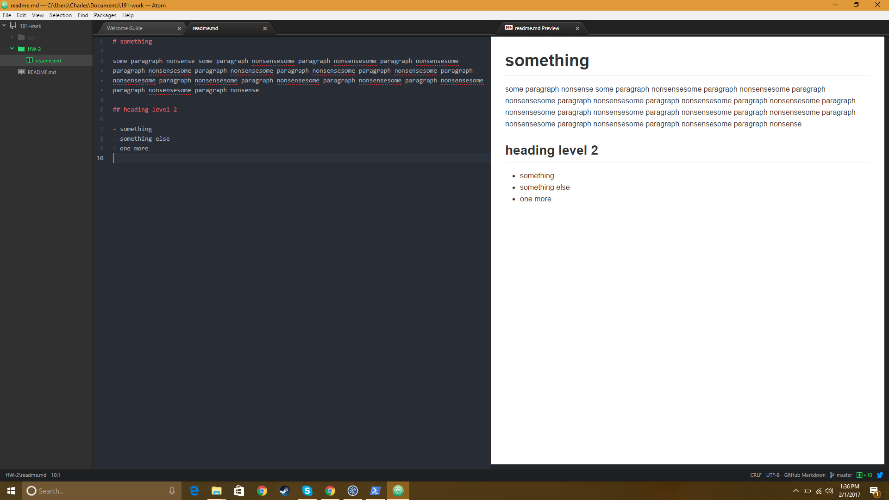

My Experience with Beginning Coding
------

This week I realized how little I actually know about computers including my *own* computer. It also made me realize how little time I explore learning how to use different applications and how uncomfertable the feeling initally is. Now that we are familiarizing more with using powershell and understanding the markdown language I am *slowly* feeling less tense and hope to eventually master this.

## The Struggle

1. The pace of this class is pretty fast for me especially since I'm still trying to understand how to use Github.
2. I hope to figure out how to use all of these applications together.
3. I'm afraid to try and upload this page onto Github by myself, really hoping I can figure that out.

### What I have Learned
- pwd stands for current working directory
- ls stands for list
- cd changes my current directory
- I learned powershell is a thing on my computer that allows me to use markdown language to open documents manually
- learned how to make a link: [facebook](https://www.facebook.com/)

#### Here's My Beautiful ScreenShot

