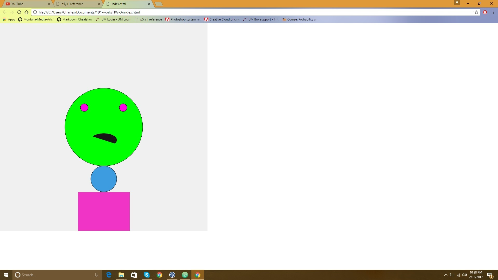

HW-3 Monster Project
-----

## What I Set Out To Do
  1. I wanted to understand more about coding
  2. I wanted to troubleshoot and be patient with myself
  3. I wanted to be creative

### References I Utilized
-P5.js References
-HW3 Instructions on Github Repository
-Professors from the Media Arts building for emotional support

#### What Worked/ What Didn't Work

What helped most was following the P5.js References instructions on what all the syntax stood for with each shape I was trying to make.
It also helped to visualize my monster drawing like a graph. However, most of what I did was guess. Guessing helped me play around and continue working on my project versus thinking too hard on what the coordinates should be.

##### The Breakthrough

My breakthrough happened when I just kept scrolling through P5.js references and messing with the shapes.
I started having fun with it once I really started practicing patience with myself and allowed myself to make mistakes.
I also discovered what it's like to make a small coding error. I thought about how frustrating it would be if I had more code on my page.
Luckily my mistake was easily found, I had just missed an 'l' on fill.

###### ScreenShot
.
